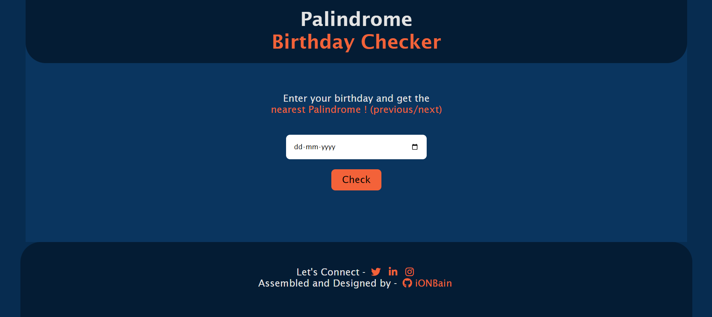
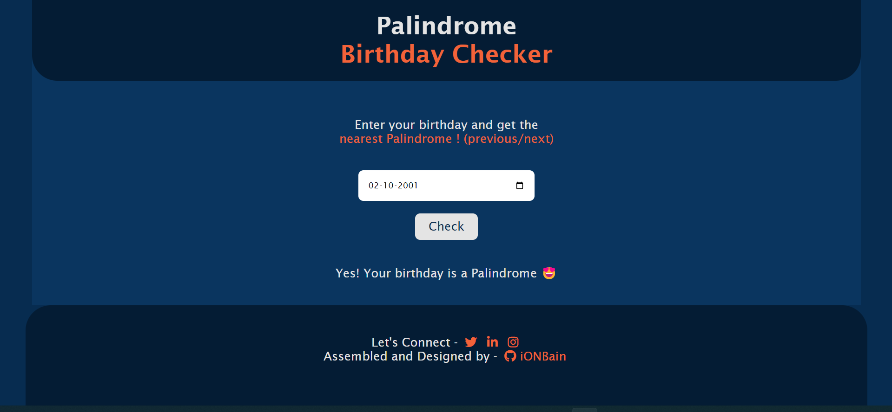
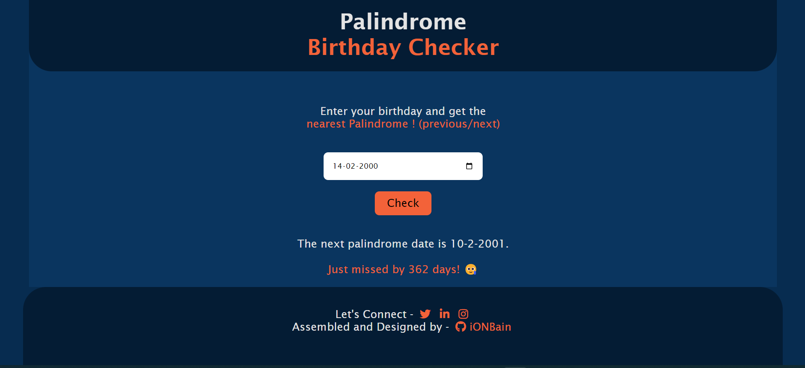
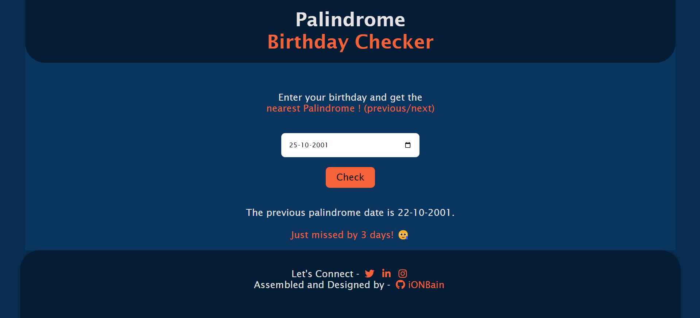

# Palindrome Birthday Checker
An app to check if your Birthday is a Palindrome or not. If not, it will tell you the nearest Palindrome date 
* from previous dates or 
* from upcoming dates

>Displays the nearest Palindrome date

Here are a few project-related insight pictures:

1. Landing Page 

2. Case1: "Birthdate is Palindrome"- 

3. Case2: "Birthdate is not a Palindrome"- Showing the next nearest Palindrome

4. Case3: "Birthdate is not a Palindrome"- Showing the previous nearest Palindrome

> Technologies/Libraries used :-
* Vanilla Javascript
* CSS
* HTML

> Platform used to develop project :-
* [Visual Studio Code](https://code.visualstudio.com/)
> Platform used to host and deploy the project :-
* [Github.com](https://github.com/ionbain)
* [Netlify.com](https://app.netlify.com/teams/bhaskartx/)

